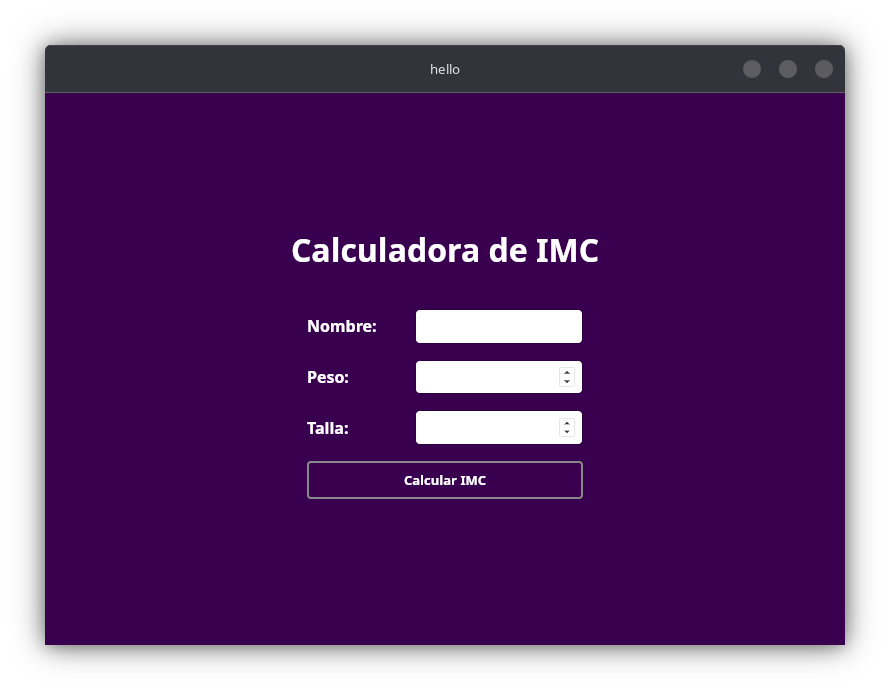
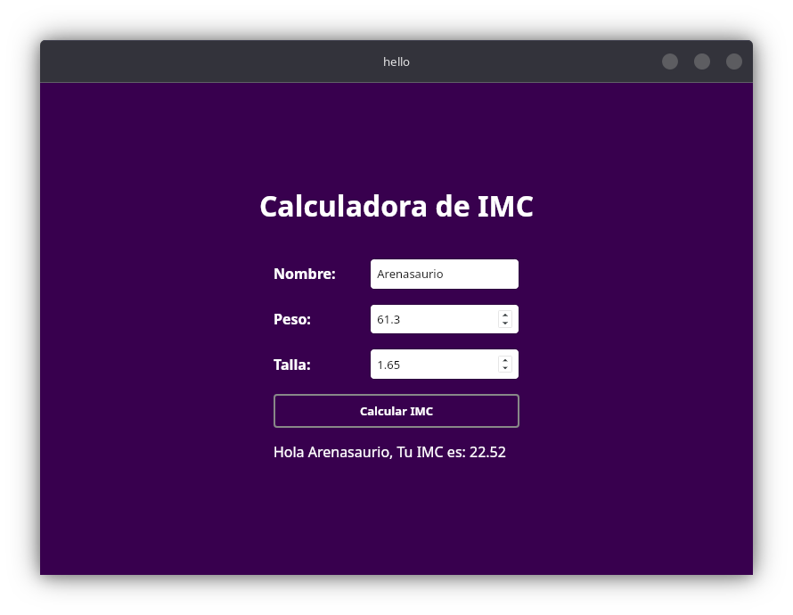

# 📊 IMC Calculator - Tauri App  

**¡Calcula y guarda tu Índice de Masa Corporal (IMC) de forma rápida y segura!**  
Una aplicación multiplataforma desarrollada con **Tauri**, usando **JavaScript Vanilla** en el frontend y **Rust** en el backend, con persistencia de datos en **SQLite3**.  

---

## 🚀 Características  

✅ **Cálculo preciso del IMC** (peso / talla²)  
✅ **Almacenamiento local** con SQLite3 (sin nube, tus datos son privados)  
✅ **Historial de usuarios** guardando:  
   - 📛 **Nombre**  
   - ⚖️ **Peso** (kg)  
   - 📏 **Talla** (m)  
   - 🔢 **IMC calculado**  
✅ **Interfaz limpia y minimalista** (Vanilla JS + CSS)  
✅ **Backend eficiente en Rust** (rápido y seguro)  

---

## 📦 Instalación  

1. **Clona el repositorio:**  
   ```sh
   git clone https://github.com/Arenasaurio/IMC-tauri.git
   cd IMC-tauri
   ```

2. **Instala dependencias:**  
   ```sh
   npm install
   ```

3. **Ejecuta en modo desarrollo:**  
   ```sh
   npm run tauri dev
   ```

4. **Build para producción:**  
   ```sh
   npm run tauri build
   ```

---

## 🖥️ Capturas de Pantalla  




---

## 🛠️ Estructura del Proyecto  

```
📂 imc-calculator-tauri/
├── 📁 src/                  # Frontend (JS Vanilla + HTML/CSS)
│   ├── index.html           # Interfaz principal
│   ├── styles.css           # Estilos
│   └── main.js              # Lógica del frontend
├── 📁 src-tauri/            # Backend (Rust + Tauri)
│   ├── Cargo.toml           # Config de Rust
│   └── src/
│       ├── main.rs          # Lógica principal
│       └── database.rs      # Manejo de SQLite3
├── 📁 public/               # Assets (imágenes, fuentes)
└── package.json             # Config de Node.js
```

---

## 📊 Cómo Funciona  

1. **El usuario ingresa:**  
   - Nombre  
   - Peso (kg)  
   - Talla (m)  

2. **Rust calcula el IMC** y lo guarda en SQLite3:  
   ```rust
   // Ejemplo de inserción en SQLite
   conn.execute(
       "INSERT INTO imc_records (name, weight, height, imc) VALUES (?1, ?2, ?3, ?4)",
       params![name, weight, height, imc],
   )?;
   ```

3. **El frontend muestra el resultado y el historial:**  
   ```javascript
   // Ejemplo de llamado a Rust desde JS
   invoke("calculate_imc", { name, weight, height })
     .then((imc) => updateResults(imc));
   ```

---

## 📌 Tecnologías Usadas  

| **Frontend** | **Backend** | **Base de Datos** |  
|--------------|-------------|-------------------|  
| JavaScript Vanilla | Rust (Tauri) | SQLite3 |  
| HTML5 + CSS3 | Serde (Serialización) | Rusqlite (Driver) |  

---

## 📜 Licencia  

MIT License - **¡Usa, modifica y comparte libremente!**  

---

**🎯 ¿Quieres contribuir?**  
¡Abre un **PR** o reporta **issues** en GitHub!  

--- 

**🔥 ¡Calcula tu IMC como un profesional!**